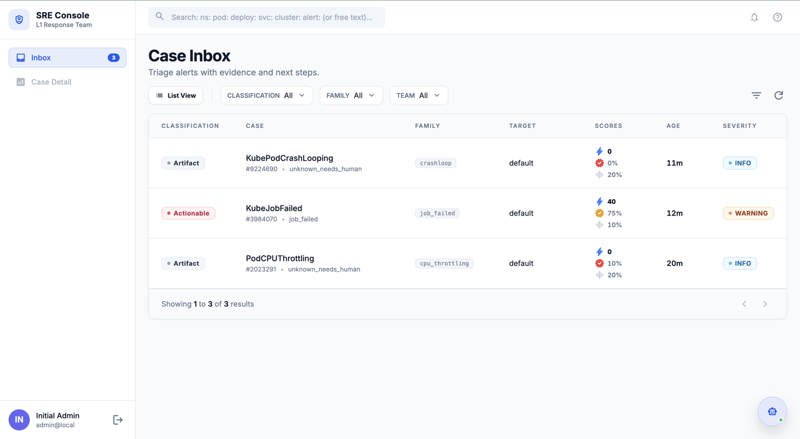
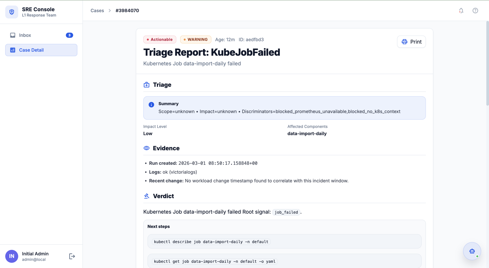
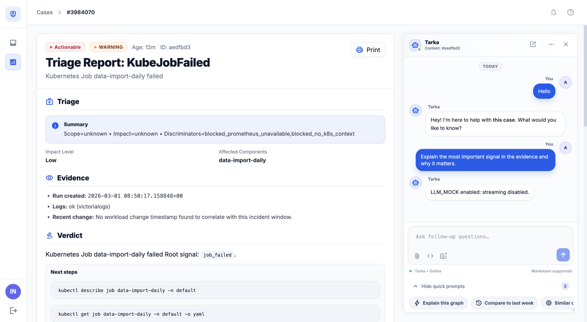
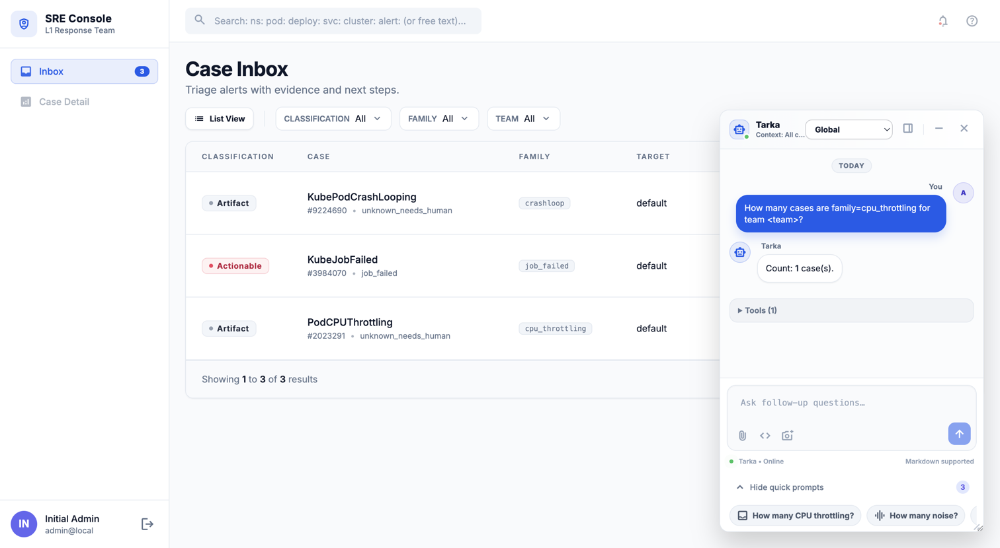

# Tarka

*Sanskrit: logic, reasoning, structured argument*

[](LICENSE)

An on-call oriented agent that turns Prometheus/Alertmanager alerts into actionable triage reports.

Designed for **small teams** to reduce "tribal knowledge" during incidents by producing consistent, honest, copy/paste-friendly investigation narratives.

## Quick Links

- **[Quickstart Guide](docs/guides/quickstart.md)** - First investigation in 5 minutes
- **[One Pager](docs/one-pager.md)** - Leadership overview and motivation
- **[Full Documentation](docs/README.md)** - Complete documentation hub

## What It Does

Converts Prometheus/Alertmanager alerts into triage reports with:
- **Deterministic base triage**: Explicit about what's known and unknown (no guessing)
- **Alert-specific playbooks**: CPU throttling, OOM, HTTP 5xx, pod health, etc.
- **Multi-source evidence**: Prometheus metrics + Kubernetes context + logs (all best-effort)
- **Read-only operations**: Safe investigation, no cluster mutations
- **Flexible deployment**: Run as CLI or in-cluster webhook service

See [Triage Methodology](docs/acceptance/triage-methodology.md) for the philosophy.

## See It in Action

**Case Inbox** -- All active alerts in one place, scored and classified automatically.



**Triage Report** -- Structured evidence, verdict, and copy-paste-ready next steps for every alert.



**Case Chat** -- Ask follow-up questions about a specific case. The agent has full context of the investigation.



**Global Chat** -- Query across all cases with tool-using AI (PromQL, kubectl, log search, and more).



Full example inputs and reports are available in the [`examples/`](examples/) directory:

- [`examples/reports/pod-crashloop/report.md`](examples/reports/pod-crashloop/report.md) -- rendered triage report
- [`examples/reports/pod-crashloop/investigation.json`](examples/reports/pod-crashloop/investigation.json) -- structured JSON analysis

## Quick Start

```bash
# Install dependencies (base + LLM provider)
poetry install                      # Base installation (no LLM)
poetry install -E vertex           # Base + Vertex AI (Gemini)
poetry install -E anthropic        # Base + Anthropic (Claude)
poetry install -E all-providers    # Base + all LLM providers

# List active alerts
poetry run python main.py --list-alerts

# Investigate a specific alert
poetry run python main.py --alert 0

# Investigate with LLM enrichment (optional)
poetry run python main.py --alert 0 --llm
```

**LLM Provider Configuration:**
- **Vertex AI**: Set `LLM_PROVIDER=vertexai`, `GOOGLE_CLOUD_PROJECT`, `GOOGLE_CLOUD_LOCATION`
- **Anthropic**: Set `LLM_PROVIDER=anthropic`, `ANTHROPIC_API_KEY`
- See [Multi-Provider LLM Guide](docs/multi-provider-llm.md) for details

For detailed setup, see [Quickstart Guide](docs/guides/quickstart.md).

## Local Development

Start a complete local development environment with one command:

```bash
# Copy environment template
cp .env.example .env

# Start PostgreSQL, NATS, and mock monitoring services
make dev-up

# Start webhook server (Terminal 2)
make dev-serve

# Start UI dev server (Terminal 3)
make dev-ui
```

**Access the UI**: http://localhost:5173
- Username: `admin`
- Password: `admin123` (or from `.env`)

**Mock Services**: The local environment includes mock Prometheus/Alertmanager/Logs that return empty data, allowing you to test the full pipeline without real infrastructure. To use real services, port-forward and update `.env`.

**Stop services**:
```bash
make dev-down
```

See the [Local Development Guide](docs/guides/local-development.md) for detailed instructions, troubleshooting, and advanced usage.

## Documentation

- **Getting Started**: [Quickstart](docs/guides/quickstart.md) • [Local Development](docs/guides/local-development.md) • [Authentication](docs/guides/authentication.md) • [Environment Variables](docs/guides/environment-variables.md)
- **Operating**: [Deployment](docs/guides/deployment.md) • [Operations](docs/guides/operations.md) • [Testing](docs/guides/testing.md)
- **Architecture**: [Overview](docs/architecture/README.md) • [Investigation Pipeline](docs/architecture/investigation-pipeline.md) • [Diagnostics](docs/architecture/diagnostic-modules.md) • [Playbooks](docs/architecture/playbook-system.md)
- **Extending**: [Adding Playbooks](docs/guides/extending-playbooks.md) • [Triage Methodology](docs/acceptance/triage-methodology.md)
- **Features**: [Chat](docs/features/chat.md) • [Actions](docs/features/actions.md) • [Memory](docs/features/memory.md) • [Multi-Provider LLM](docs/multi-provider-llm.md)
- **Roadmap**: [Completed](docs/roadmap/completed.md) • [Planned](docs/roadmap/planned.md)

## Requirements

- **Prometheus-compatible API** (required) - For metrics and scope calculation
- **Kubernetes API** (optional but recommended) - For pod context and events
- **VictoriaLogs** (optional) - For log evidence (agent remains useful without logs)

## Contributing

We welcome contributions! See [CONTRIBUTING.md](CONTRIBUTING.md) for development setup, coding standards, and PR guidelines.

## License

Licensed under the [Apache License 2.0](LICENSE).

&copy; 2026 Dinesh Auti and the Tarka Contributors.
