# Architecture Overview

The Tarka converts Prometheus/Alertmanager alerts into actionable triage reports through a structured investigation pipeline.

## System Design

```
Alert → Investigation (SSOT) → Evidence → Diagnostics → Verdict → Report
```

### Core Principle

**Investigation as Single Source of Truth**: One immutable data structure flows through the entire pipeline, accumulating evidence and analysis at each stage.

## Key Abstractions

### Investigation

The `Investigation` object (`agent/core/models.py`) is the central data structure containing:

- **Alert**: Original Alertmanager payload (labels, annotations, state, fingerprint)
- **Target**: What's affected (pod, workload, service, node, cluster, unknown)
- **Evidence**: Kubernetes context, Prometheus metrics, logs (all best-effort)
- **Analysis**: Hypotheses, verdict, base triage decision, family enrichment
- **Scores**: Impact, confidence, noise (0-100 scales)
- **Metadata**: Timestamps, errors, derivedfeatures

Everything mutates this one object as evidence is gathered.

### Target Recognition

**TargetRef** identifies what the alert is about:

- **Pod-scoped**: `pod` + `namespace` + optional `container`
- **Workload-scoped**: `Deployment`, `StatefulSet`, `DaemonSet`, etc.
- **Service-scoped**: `service` + `namespace`
- **Node-scoped**: `node` or `instance`
- **Cluster-scoped**: `cluster`
- **Unknown**: When attribution fails (triggers Scenario A)

### Evidence Sources

1. **Prometheus** (required): Scope, blast radius, alert-specific metrics
2. **Kubernetes** (optional): Pod info, conditions, events, owner chains, rollout status
3. **VictoriaLogs** (optional): Application logs, query with time window

All evidence collection is **best-effort** - failures are recorded but don't block report generation.

### Base Triage Contract

Every report has `analysis.decision`:

- **label**: One-line headline (`scope=pod impact=unavailable discriminator=CrashLoopBackOff`)
- **why**: 6-10 evidence-backed bullets (or explicit unknowns)
- **next**: 3-7 copy/paste commands (PromQL first, then kubectl)

**Critical principle**: When evidence is missing, don't guess. Say "unknown" and show how to unblock.

### Blocked Scenarios

When inputs are unavailable, explicit scenarios:

- **A**: Target identity missing (can't attribute impact)
- **B**: Kubernetes context missing (no pod info/conditions/events)
- **C**: Logs unavailable (backend down or no logs found)
- **D**: Prometheus scope unavailable (can't compute blast radius)

## Data Flow

```mermaid
flowchart LR
    Alert --> Normalize
    Normalize --> InferTarget
    InferTarget --> CreateInvestigation
    CreateInvestigation --> Playbook
    Playbook --> EvidenceCollection
    EvidenceCollection --> Diagnostics
    Diagnostics --> BaseVerdict
    BaseVerdict --> FamilyEnrichment
    FamilyEnrichment --> Scoring
    Scoring --> Report
```



### Pipeline Stages

1. **Normalization**: Parse alert payload, extract labels/annotations
2. **Target Inference**: Best-effort pod/workload/service identification
3. **Family Detection**: Classify alert type (cpu_throttling, oom_killed, etc.)
4. **Playbook Selection**: Route to alert-specific investigation logic
5. **Evidence Collection**: Gather K8s, metrics, logs (best-effort)
6. **Diagnostic Modules**: Run universal failure mode detectors
7. **Noise Analysis**: Flapping, cardinality, label issues
8. **Change Correlation**: Link to K8s rollouts/deployments
9. **Base Verdict**: Build deterministic triage decision
10. **Family Enrichment**: Alert-type-specific analysis
11. **Scoring**: Impact/confidence/noise (0-100)
12. **Report Generation**: Markdown output with label, why, next

## Component Architecture

### Playbooks (`agent/playbooks/`)

Alert-type-specific evidence collectors:

- Route alerts to tailored investigation logic
- Query Prometheus for alert-specific metrics
- Fetch relevant K8s objects
- Query logs with optimized time windows
- Populate `investigation.evidence.*`

**Examples**: `cpu_throttling.py`, `oom_killer.py`, `pod_not_healthy.py`

### Diagnostic Modules (`agent/diagnostics/`)

Universal failure mode detectors that run after evidence collection:

- Check if module applies to current investigation
- Optionally collect additional evidence
- Generate `Hypothesis` objects with confidence scores (0-100)
- Propose actions (policy-gated)

**Examples**: Image pull failures, crash loops, resource contention, K8s rollout health

### Providers (`agent/providers/`)

External service clients with graceful degradation:

- **PrometheusClient**: PromQL instant queries, range queries
- **KubernetesClient**: Pod/workload info, conditions, events, owner chains
- **VictoriaLogsClient**: Log queries with time window
- **AlertmanagerClient**: Active alert fetching, fingerprint matching

### Pipeline (`agent/pipeline/`)

Investigation orchestration:

- **pipeline.py**: Main investigation runner (11 stages)
- **verdict.py**: Base triage decision builder (scenarios A-D)
- **enrich.py**: Family-specific enrichment
- **scoring.py**: Impact/confidence/noise scoring
- **features.py**: Derived features extraction
- **noise.py**: Flapping and cardinality analysis
- **changes.py**: Change correlation (rollouts)
- **capacity.py**: Rightsizing recommendations

### Memory (`agent/memory/`)

Case-based reasoning:

- **caseize.py**: Convert investigations to reusable cases
- **case_retrieval.py**: Similarity search (family + cluster + namespace/workload)
- **skills.py**: Extract patterns from past incidents
- **PostgreSQL backend**: Case metadata and embeddings

### Chat (`agent/chat/`)

Tool-using assistant for case exploration:

- **runtime.py**: Chat with policy enforcement
- **tools.py**: PromQL, K8s, logs, memory, actions
- **Policy-gated**: Read-only operations, cost caps, scope limits

### API (`agent/api/`)

Production deployment:

- **webhook.py**: Alertmanager webhook receiver (FastAPI)
- **worker_jetstream.py**: NATS JetStream consumer
- **worker.py**: Single-job investigation runner

## Documentation Navigation

- **[Investigation Pipeline](investigation-pipeline.md)** - Detailed pipeline walkthrough
- **[Diagnostic Modules](diagnostic-modules.md)** - Universal failure mode detection
- **[Playbook System](playbook-system.md)** - Alert routing and evidence collection
- **[Triage Methodology](../acceptance/triage-methodology.md)** - Quality philosophy
- **[Base Contract](../acceptance/base-contract.md)** - label + why + next; scenarios A-D

## Design Principles

1. **Investigation SSOT**: One mutable object through entire pipeline
2. **Honesty over guessing**: Explicit unknowns when evidence missing
3. **Read-only operations**: Never mutates cluster state
4. **Best-effort evidence**: Failures recorded but don't block report
5. **PromQL-first actions**: Copy/paste-friendly next steps
6. **Deterministic base triage**: Scenarios A-D for blocked modes
7. **Additive enrichment**: Family enrichment never contradicts base triage
