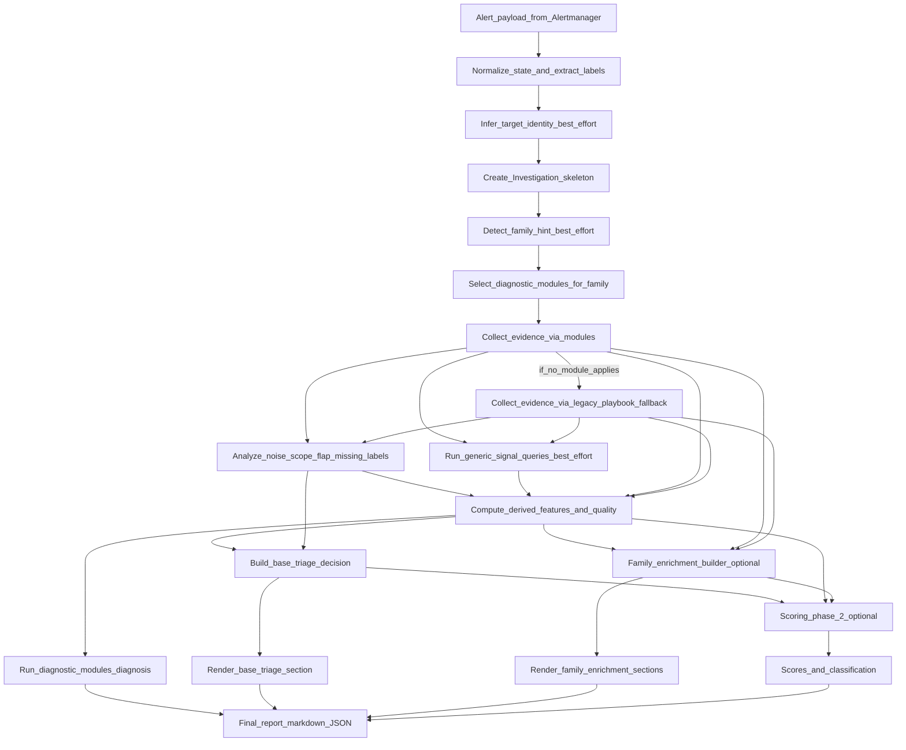

# Investigation Pipeline

This document explains how investigations work: how alerts become actionable reports through a structured pipeline where the **`Investigation` object is the single source of truth**.

## Investigation as Single Source of Truth (SSOT)

The core design principle: one `Investigation` object flows through the entire pipeline, accumulating evidence and analysis at each stage.

**The Investigation object** (`agent/core/models.py`) contains:
- **Alert**: Original Alertmanager payload (labels, annotations, fingerprint)
- **Target**: What's affected (pod, workload, service, node, cluster, unknown)
- **Evidence**: K8s context, Prometheus metrics, logs (all best-effort/optional)
- **Analysis**: Hypotheses from diagnostics, verdict, base triage decision
- **Scores**: Impact (0-100), confidence (0-100), noise (0-100)
- **Metadata**: Timestamps, errors, derived features

Everything mutates this one object. No parallel investigation objects. No merging. One truth.

## How the Base Checklist, Blocked Scenarios, and Enrichment Tie Together

This document explains how the **base checklist**, **blocked scenarios**, **family enrichment**, and **scoring** tie together around the Investigation SSOT.

## Short answers to your questions

### Are scenarios only when something goes wrong?

Mostly yes: Scenarios A–D are **blocked-mode templates** that apply when required inputs are missing or unreliable (identity/scope/K8s context/logs).

When nothing is wrong (all evidence sources work and identity is attributable), the base layer still runs, but it is effectively a **“normal/unblocked” path**:
- the base triage (`analysis.decision`) should have a concrete discriminator (not “blocked”)
- then we add family enrichment
- then we score (phase 2 later)

### When multiple conditions are true, should base decision list both?

Yes. The base triage should reflect **all active blockers** so on-call doesn’t chase a single narrative.

Recommended representation:
- `decision.label`: keep it short but allow multiple discriminators, e.g.
  `Scope=unknown • Impact=unknown • Discriminators=blocked_prometheus_unavailable,logs_missing`
- `decision.why`: add one bullet per blocker with details (status/backend/reason/what to verify)

### How do we go from alert_payload → Investigation without K8s/logs/metrics calls?

We create a **skeleton investigation** using only the alert payload + time window:
- parse labels/annotations
- normalize alert state (firing/resolved)
- infer best-effort target identity from labels (namespace/pod/service/instance/cluster)
- set time window + metadata
- initialize empty evidence/analysis/errors

No external calls are needed for investigation creation. External calls happen **after** we have the investigation (playbooks/enrichment).

## Correct flow diagram (named steps)

## Step-by-step walkthrough (what happens where)

### 1) Investigation creation (no external calls)

**Input**: raw alert payload (labels/annotations/status/fingerprint) + selected time window string
**Output**: `Investigation` with best-effort identity + empty evidence

This stage should do:
- **Normalize** Alertmanager state → `normalized_state` (firing/resolved/unknown)
- **Best-effort target inference**:
  - if `namespace`+`pod` exist → target_type `pod`
  - else if `service` exists → target_type `service`
  - else if `instance` exists → target_type `node`
  - else if `cluster` exists → target_type `cluster`
  - else → target_type `unknown`
- **Initialize**:
  - `investigation.evidence` empty
  - `investigation.analysis` empty (no `features/scores/verdict/decision` yet)
  - `investigation.errors` empty

This is purely deterministic parsing; no K8s/Prometheus/logs calls.

### 2) Evidence collection (external calls happen here)

**Goal**: populate `investigation.evidence.*` best-effort.

This is where **diagnostic modules** (and their collectors) call:
- Kubernetes API (pod info/conditions/events/owner chain/rollout status)
- Prometheus (alert-specific metrics, restart/cpu/memory/http queries)
- Logs backend (Loki/VictoriaLogs)

Legacy playbook routing remains as a fallback for `generic`/unsupported families.

Important: evidence collection should be **best-effort and non-fatal**:
- failures append to `investigation.errors`
- partial evidence still yields a usable report (on-call needs *something*)

### 3) Noise/scope analysis (external call, but can be best-effort)

Noise analysis tries to compute:
- scope counts (`firing_instances`, `active_instances`)
- flap estimate
- missing labels + cardinality hints

If it fails (Scenario D), we do **not** guess scope; we tell the on-call to verify.

### 4) Derived features & quality (deterministic transformation)

`compute_features(investigation)` turns raw evidence into:
- normalized, compact K8s signals
- logs availability status (ok/empty/unavailable)
- “quality” signals: missing inputs, impact signals available, contradictions, age

This is deterministic and should not call external systems.

### 5) Base triage decision builder (where scenarios A–D live)

This produces `investigation.analysis.decision` which is the **base report layer**.

It should:
- follow the **scenario selection matrix** in `docs/report_acceptance/base_checklist.md`
- list **all active blockers** (not just one)
- produce `decision.next` as PromQL-first commands to unblock the investigation

This is the “first 60 seconds” on-call experience.

### 6) Family enrichment (optional, additive)

Family enrichment is only allowed to:
- add concrete discriminators/evidence/next steps specific to the alert family
- never contradict the base triage honesty about missing evidence

Think of enrichment as: “Now that we know it’s `pod_not_healthy`, here’s the specific K8s reason + actions.”

### 7) Scoring (phase 2)

Scoring should come last and must be consistent with:
- blockers (A/B/C/D): lower confidence / higher noise / avoid “actionable” when blocked
- scope labels: avoid “noise=0” when blast radius is high

Scoring should *summarize* the situation; it should not be the only way the report becomes actionable.

## Road ahead (how this becomes real in code, later)

Phase 1 (base report usefulness):
- Implement the deterministic decision builder that fills `analysis.decision` using the scenario matrix + canonical discriminators.
- Render `analysis.decision` near the top of the report (before scores).

Phase 1.5 (family enrichment):
- Add family enrichment builders one-by-one (starting with the most frequent/high-cost alerts).

Phase 2 (scoring):
- Recalibrate scoring to respect blockers and avoid false confidence/incorrect noise.
